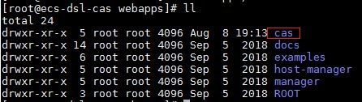
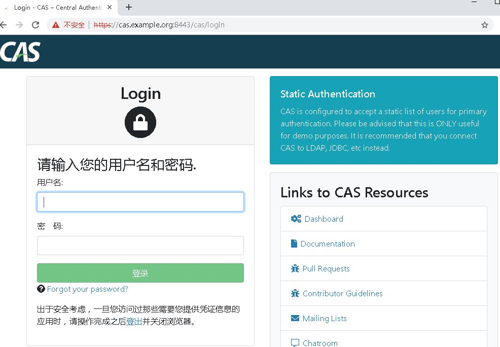

## CAS部署

[cas-overlay-template](https://github.com/apereo/cas-overlay-template)

JDK8

Tomcat8


### Tomcat配置https

生成证书

```bash
# generate keystore
keytool -genkey -alias tomcat -keyalg RSA -validity 3650 -keystore tomcat.jks
# 导出证书
keytool -export -alias tomcat -keystore tomcat.jks -file tomcat.crt
# 将证书导入JRE cacerts. 以下keystore路径以实际路径为准
keytool -import -file tomcat.crt -alias tomcat -keystore /opt/jdk/jre/lib/security/cacerts 
```

tomcat配置证书

将上面生成的tomcat.jks复制到tomcat conf目录

```bash
cp tomcat.jks /opt/tomcat/conf
```

修改tomcat server.xml添加

```xml
<Connector port="8443" protocol="org.apache.coyote.http11.Http11NioProtocol"
           maxThreads="200" SSLEnabled="true" scheme="https"
           secure="true" clientAuth="false" sslProtocol="TLS"
           keystoreFile="./conf/tomcat.jks"
           keystorePass="changeit"/>
```

测试https


### 部署CAS

编译cas包

***编译前请准备***
```text
安装maven
```
```bash
git clone https://github.com/apereo/cas-overlay-template.git
cd cas-overlay-template
git checkout 5.3.9
mvn clean package
```

以上步骤将在target目录生成cas.war文件，将该文件解压至tomcat/webapps目录



重启tomcat，访问cas



**注：**

1. 如果CAS启动出现如下错误，在编译cas时，添加如下依赖
```xml
<dependency>
    <groupId>javax.xml.bind</groupId>
    <artifactId>jaxb-api</artifactId>
    <version>2.3.1</version>
</dependency>
```
2. 上图中直接访问了cas默认的域名，这种方式请现在本地hosts文件添加映射


### 配置访问Dashboard

默认情况下，访问dashboard，提示 Access Denied。 修改配置文件application.properties开启访问

配置请参考：

【1】 https://blog.csdn.net/fireofjava/article/details/79243868

【2】 https://apereo.github.io/cas/5.2.x/installation/Configuration-Properties.html#spring-boot-endpoints


## 搭建 cas-management

```bash
git clone git clone https://github.com/apereo/cas-management-overlay.git
cd cas-management-overlay
git checkout 5.3
mvn clean package
```

执行以上命令后在target目录生成cas-management

* 配置cas服务地址(application.properties)

```text
cas.server.name=https://cas.example.org:8443
cas.server.prefix=${cas.server.name}/cas
```


## CAS 集成 SAML

在pom.xml中添加saml依赖，重新编译，执行部署流程

```xml
<dependency>
  <groupId>org.apereo.cas</groupId>
  <artifactId>cas-server-support-saml-idp</artifactId>
  <version>${cas.version}</version>
</dependency>
```

启动后访问： https://cas.example.org:8443/cas/idp/metadata 就能得到 SAML 接入的 metadata，以及各种 URL 地址了。在 /etc/cas/saml 下能得到这个 metadata 的 xml 定义文件，以及各证书。

为使CAS能够加载注册的各种应用(service)，请在application.properties中追加配置

```text
cas.serviceRegistry.initFromJson=true
```

否则

* SAML集成示例（CAS作为IDP，华为云服务作为SP）

1. 双方交换SAML元数据

1.1 下载华为云元数据文件 https://auth.huaweicloud.com/authui/saml/metadata.xml, 保存为*huaweicloud-metadata.xml*

1.2 将*huaweicloud-metadata.xml*上传到cas服务器/etc/cas/saml目录

1.3 添加华为云服务描述文件


```json
{
  "@class" : "org.apereo.cas.support.saml.services.SamlRegisteredService",
  "serviceId" : "https://auth.huaweicloud.com/",
  "name" : "huaweicloud",
  "id" : 10000004,
  "evaluationOrder" : 10,
  "metadataLocation" : "/etc/cas/saml/huaweicloud-metadata.xml"
}
```

1.4 下载cas saml元数据文件，导入到华为云中，具体操作参考 https://support.huaweicloud.com/usermanual-iam/zh-cn_topic_0046611277.html


