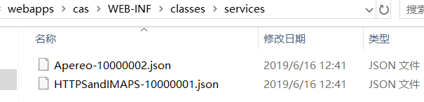

## CAS客户端登录

客户端应用使用CAS登录时，需要预先将应用注册到CAS。

CAS默认的service管理使用本地文件方式，注册的服务以json格式存在目录 WEB-INF/classes/services



使用本地文件管理service需要开启配置
```bash
cas.serviceRegistry.initFromJson=true
```

开启后，将支持**所有**https协议和imaps协议客户端，修改HTTPSandIMAPS-10000001.json来支持http协议客户端
```json
{
  "@class" : "org.apereo.cas.services.RegexRegisteredService",
  "serviceId" : "^(https|http|imaps)://.*",
  "name" : "HTTPS and IMAPS",
  "id" : 10000001,
  "description" : "This service definition authorizes all application urls that support HTTPS and IMAPS protocols.",
  "evaluationOrder" : 10000
}

```

如果只希望授权特定应用登录，可修改serviceId，或者添加更多的service文件