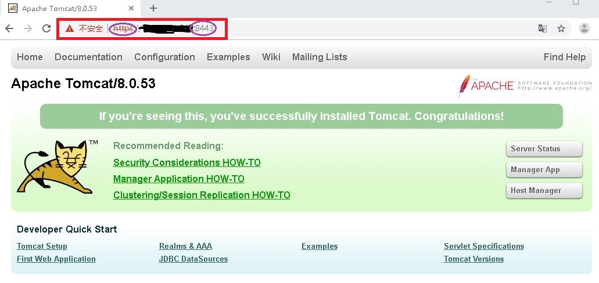
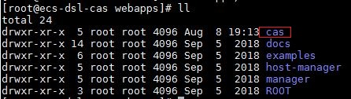
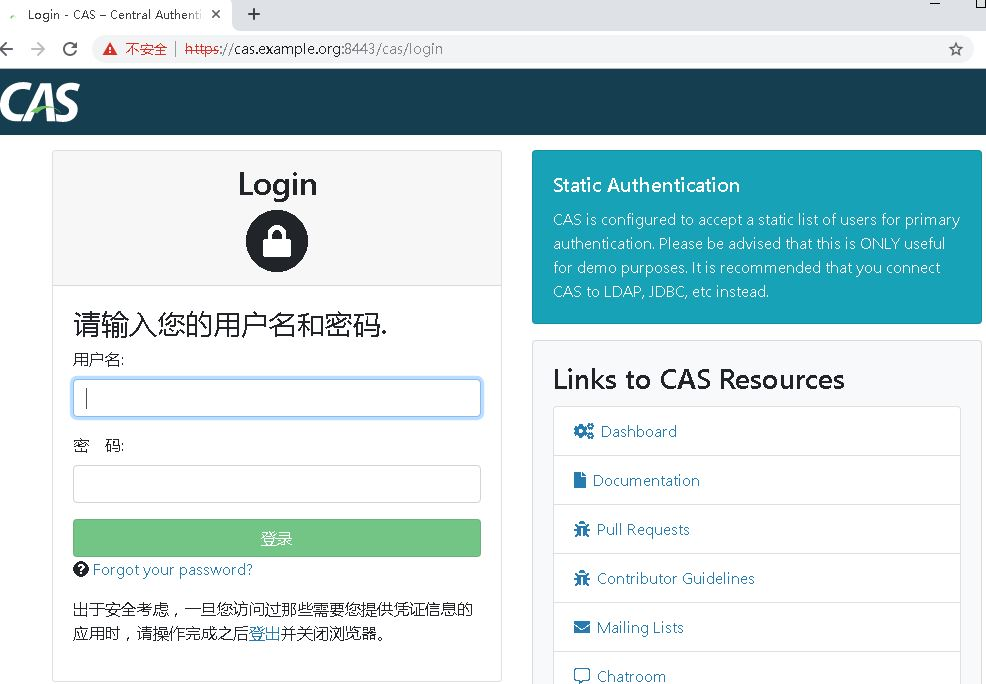

## CAS单点登录 -- 搭建

### 官方文档

官方文档： https://apereo.github.io/cas/5.3.x/index.html#

### 打包工程

[cas-overlay-template](https://github.com/apereo/cas-overlay-template)

### 运行环境

JDK8

Tomcat8

### Tomcat配置https

生成证书

```bash
# generate keystore
keytool -genkey -alias tomcat -keyalg RSA -validity 3650 -keystore tomcat.jks
# 导出证书
keytool -export -alias tomcat -keystore tomcat.jks -file tomcat.crt
# 将证书导入JRE cacerts. 以下keystore路径以实际路径为准
keytool -import -file tomcat.crt -alias tomcat -keystore /opt/jdk/jre/lib/security/cacerts 
```


tomcat配置证书

将上面生成的tomcat.jks复制到tomcat conf目录

```bash
cp tomcat.jks /opt/tomcat/conf
```

修改tomcat server.xml添加

```xml
<Connector port="8443" protocol="org.apache.coyote.http11.Http11NioProtocol"
           maxThreads="200" SSLEnabled="true" scheme="https"
           secure="true" clientAuth="false" sslProtocol="TLS"
           keystoreFile="./conf/tomcat.jks"
           keystorePass="changeit"/>
```

测试https



### 部署CAS

编译cas包

***编译前请准备***
```text
安装maven
```
```bash
git clone https://github.com/apereo/cas-overlay-template.git
cd cas-overlay-template
git checkout 5.3.9
mvn clean package
```

以上步骤将在target目录生成cas.war文件，将该文件解压至tomcat/webapps目录



重启tomcat，访问cas



**注：**

1. 如果CAS启动出现如下错误，在编译cas时，添加如下依赖
```xml
<dependency>
    <groupId>javax.xml.bind</groupId>
    <artifactId>jaxb-api</artifactId>
    <version>2.3.1</version>
</dependency>
```

2. 上图中直接访问了cas默认的域名，这种方式请现在本地hosts文件添加映射
