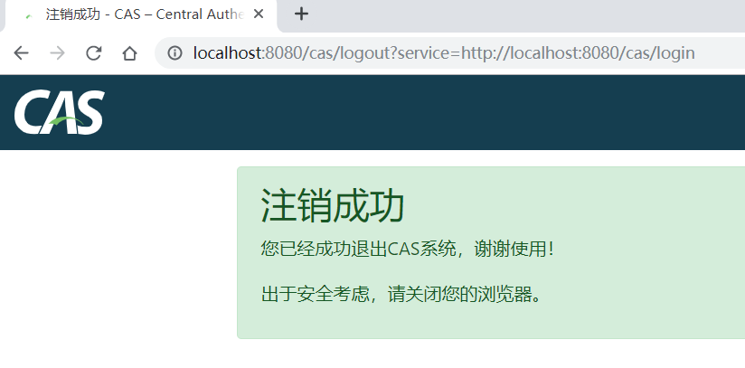

## CAS单点登出


### CAS登出

CAS登出默认不允许重定向至指定的url，而是转到CAS默认的登出成功提示页面



通过配置

```bash
# 是否允许登出重定向，默认为false，此处将其改为true
# cas.logout.followServiceRedirects=true
# 重定向参数key
# cas.logout.redirectParameter=service
# 登出后默认重定向地址
# cas.logout.redirectUrl=https://www.github.com
# cas.logout.confirmLogout=false
# cas.logout.removeDescendantTickets=false
```

### CAS单点登出